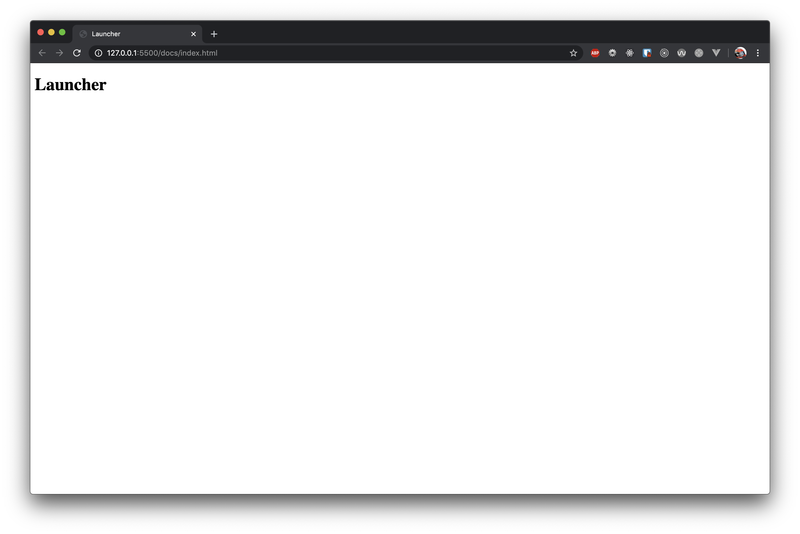

# Launcher

> A client-side rendered web application that shows SpaceX data, built from scratch.



## Installation
```bash
# Clone the repository
git clone link/to/repo

# Install dependencies using yarn or npm
yarn / npm install

# Run a local development environment on port x
yarn dev / npm run dev
```

## Features
### Overview
An overview of the data a user wants to see

### Filtering
The user can choose which data they want to see as long if it's one of the following:
- Launches
- Rockets
- etc.

### Details
User can see details on a detail page.

## API
For this project I used the SpaceX API. You can view the docs [here]().

### Overview
The SpaceX API is an API that shows lots of SpaceX data.

### Endpoints used
The application uses the following endpoints of the SpaceX API:

- `/launches`
	- Shows all launches from SpaceX, results get updated regularly

### API limitations
About the API limitations

## Project wishlist


<!-- How about a license here? 📜 (or is it a licence?) 🤷 -->
